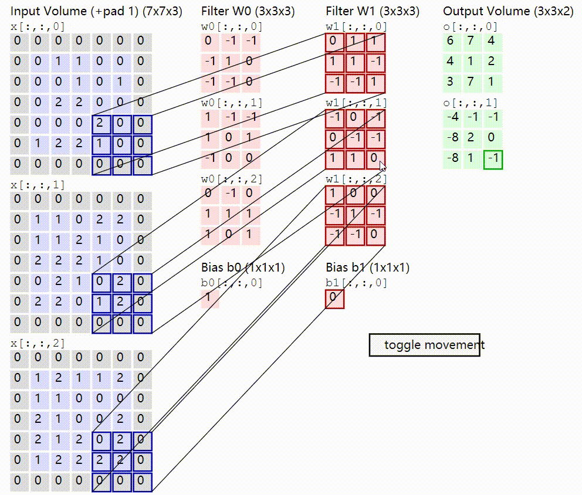
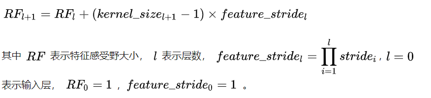
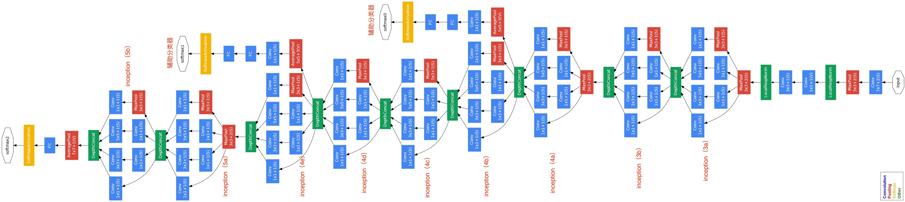
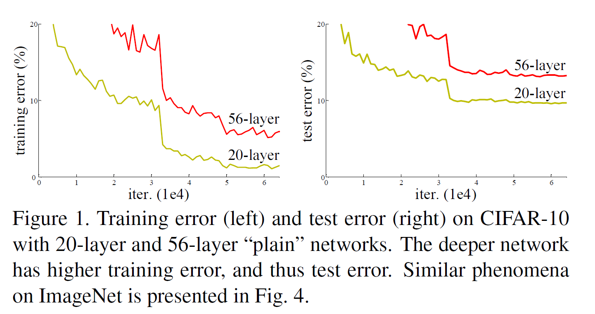
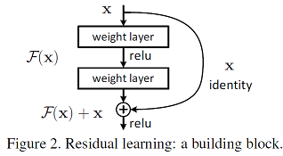
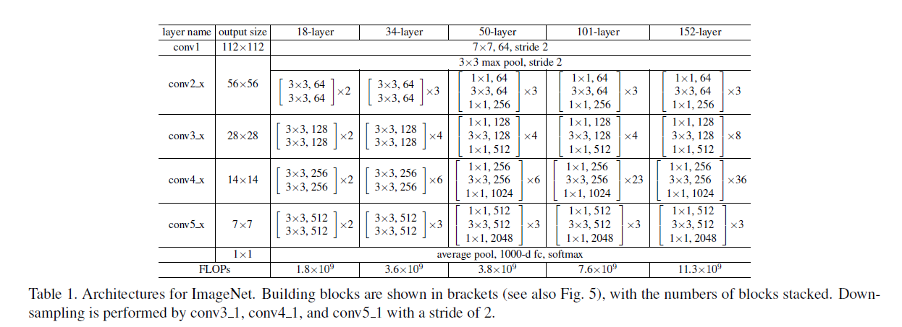
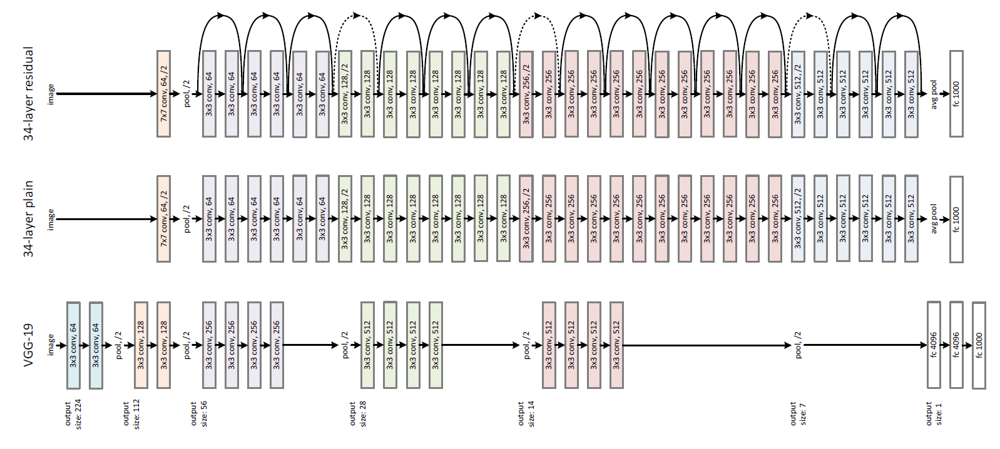
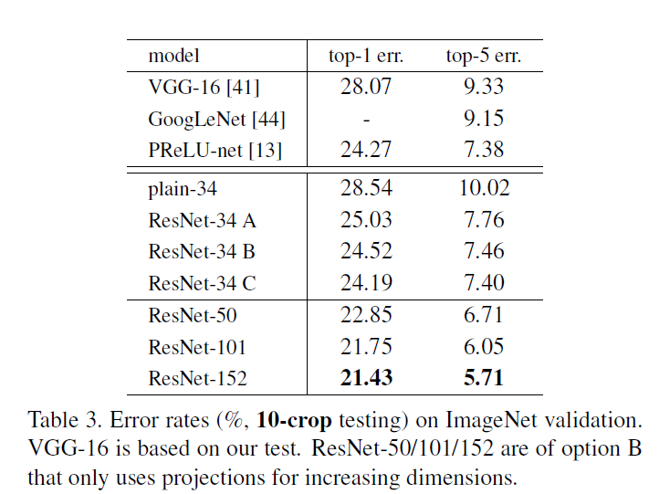
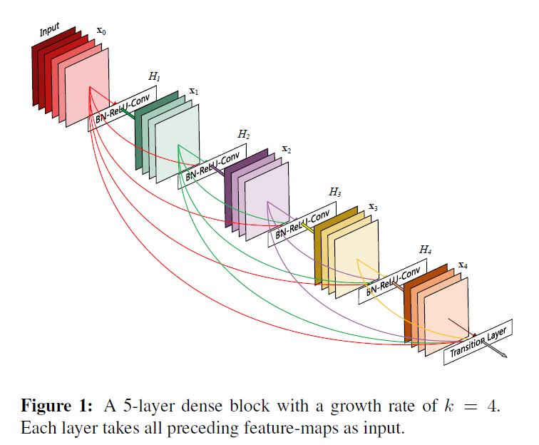
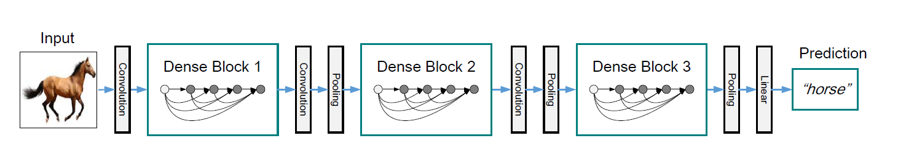

[toc]
# CNN
## CNN base
### 数字信号处理中的卷积与CNN中的卷积
在数字信号处理中卷积：

但深度学习中的卷积运算实质上是在滤波器(卷积核->通过反向传播得到的权重)和输入的局部区域之间执行点积。换句话说在目前的很多深度学习框架执行卷积前向计算时不会反转卷积核的操作(一些则会提前将反转后的卷积核储存，但实际进行运算的使用的是点积，而不同框架的实现不同，但是不影响我们的理解)。


### 卷积层的传入参数以及具体运算过程
```python
torch.nn.Conv2d(in_channels, out_channels, kernel_size, stride=1, padding=0, dilation=1, groups=1, bias=True)
'''
in_channels(int) – 输入信号的通道
out_channels(int) – 卷积产生的通道
kernel_size(int or tuple) - 卷积核的尺寸
stride(int or tuple, optional) - 卷积步长
padding(int or tuple, optional) - 输入的每一条边补充0的层数
dilation(int or tuple, optional) – 卷积核元素之间的间距
groups(int, optional) – 从输入通道到输出通道的阻塞连接数
bias(bool, optional) - 如果bias=True，添加偏置。bias与BatchNorm2d一般不共存
'''
```
* 计算公式
$$
out(N_i, C_{out_j})=bias(C_{out_j})+\sum^{C_{in}-1}_{k=0}weight(C{out_j},k)\bigotimes input(N_i,k)
$$
* 输出张量的长度
输入图片大小：W x W ，Filter大小：F x F，Stride：S，Padding ：P，输出图片：N x N
$$
N = ( W - F + 2*P )/S + 1
$$
* 一个例子
```python
torch.nn.Conv2d(in_channels=3, out_channels=2, kernel_size=3, stride=2, padding=1)
```


### 卷积和全连接
* 对比
卷积不过是一个稀疏的全连接，全连接也不过是一个画面那么大的卷积。两者本质上都可以理解
为矩阵乘法。在不考虑层数的情况下可以理解conv就是拿一个小点的fc不停的在图片不同位置上跑。
* 深度学习的几大流程同样适用于cnn网络(前向，反向，更新权值)，只不过权值由全连接网络中的连接权重变为了卷积核。
* 在卷积激活函数，batchnorm, 池化等操作依然有效。
* 卷积的优点(其实主要都是针对图像的)
卷积的优点：输入更灵活，可以接受任意分辨率的图像；使用stride和polling或空洞卷积减少计算量；可以很好捕捉图像这种有空间相关性输入的特征。

### [感受野]( https://zhuanlan.zhihu.com/p/40267131 )
<br>
感受野（receptive field，RF）就是卷积神经网络特征所能看到输入图像的区域。在设计CNN的时候感受野很容易被忽略，但往往对模型效果有很大影响。<br>

*  计算方法


一般来说，CNN最后一层的感受野需要大于原始图像中需要分辨的最大物体的尺寸，这样才能获得比较理想的结果。

* 为什么一般语音信号不直接使用CNN的原因


### 梯度爆炸与梯度消失

与一般的神经网络类似CNN在反向传播的时候也容易出现梯度爆炸与梯度消失的现象一样。
解决办法：

* 好的参数初始化方式，如He初始化
* 非饱和的激活函数（如 ReLU）
* 批量规范化（Batch Normalization）
* 梯度截断、正则（Gradient Clipping）
* 更好的优化器
```python
# 为了解决这个问题一般的cnn层都含有BatchNorm2d以及ReLU
self.conv = nn.Sequential(
    nn.Conv2d(inchannel, 64, kernel_size=7, stride=2, padding=3, bias=False),
    nn.BatchNorm2d(64),
    nn.ReLU(inplace=True),
)
```
## [CNN发展历史](https://zhuanlan.zhihu.com/p/66215918)
### LeNet(5 layers) 1998 
LeNet-5是1998年YannLeCun设计用于手写数字识别的模型。<br>
<br>


### AlexNet(8 layers)  2012
<br>
1.相比LeNet，AlexNet设计了更深层的网络。<br>
2.在每个卷机后面添加了Relu激活函数，解决了Sigmoid的梯度消失问题，使收敛更快。<br>
3.添加了归一化LRN（Local Response Normalization，局部响应归一化）层，使准确率更高。<br>
4.设计并使用了dropout层，减轻了模型的过拟合。<br>
5.通过裁剪，旋转等方式增强了训练数据。<br>
6.受于当时的算力限制，Alexnet创新地将图像分为上下两块分别训练，然后在全连接层合并在一起（AlexNet网络图1，可以看到有上下两部分）。<br>


### VGGNet(19 layers)  2014 
<br>
1.探索了更深层次的网络结构图，可以看成是AlexNet的加强版本。<br>
2.在卷机设计上，使用了更小的卷机核，验证了小尺寸的卷机核在深度网络中，不仅减少了参数，也达到了更好的效果。<br>


### GoogleNet(22 layers)  2014 

1.引入Inception概念，在当时流行模型‘加深’情况下，设计了‘加宽’的思路<br>
2.采用Network in Network中用Average pool来代替全连接层的思想。实际在最后一层还是添加了一个全连接层，是为了大家做finetune。<br>
3.另外增加了两个辅助的softmax分支<br>

<br>
<br>
<br>
<br>
再深性能就下降了？？？？？为什么？？？<br>
<br>

* 过拟合？ Overfitting？ ×<br>
训练集的错误率也上升了！
* 梯度爆炸/消失？ Gradient Exploding/Vanishing？× <br>
批量规范化（Batch Normalization）已经被证明能很好的解决这个问题。
* 网络退化✔
当我们堆叠一个模型时，理所当然的会认为效果会越堆越好。因为，假设一个比较浅的网络已经可以达到不错的效果，那么即使之后堆上去的网络什么也不做，模型的效果也不会变差。<br>
然而事实上，这却是问题所在。让以非线性著称的深度神经网络“什么都不做”恰好是最难做到的东西之一。<br>
《Skip connections eliminate singularities》提出神经网络的退化才是难以训练深层网络根本原因所在，而不是梯度消散<br>


### ResNet(18~152 layers) 2015
想法很朴素：网络退化的原因许赋予神经网络无限可能性的“非线性”让神经网络模型走得太远，却也让它忘记了为什么出发。那么跳过没必要的非线性不就好了！！！<br>
于是一篇被43969次引用的文章诞生了。<br>
[Deep Residual Learning for Image Recognition](https://arxiv.org/abs/1512.03385)<br>

中心思想：如果深层网络后面的层都是是恒等映射，那么模型就可以转化为一个浅层网络，就不会出现退化问题了。所以用短路(shortcut)就很简单的解决了恒等映射的实现.<br>

* 实际网络：
$$
H(x) = F(x) + x
$$
* 实际要学习的残差函数：
$$
F(x) = H(x) - x
$$
* 如果不使用残差，为了实现恒等映射需要拟合的是：
$$
F(x) = x
$$
* 使用残差，为了实现恒等映射需要拟合的是：
$$
F(x) = 0
$$
* 网络结构
<br>
<br>
<br>
152层!!!<br>
152层!!!<br>
152层!!!<br>
<br>

* 残差块的代码实现
```python
class ResidualBlock(nn.Module):
    def __init__(self, inchannel, outchannel,kernel_size,stride=2):
        super(ResidualBlock, self).__init__()
        self.stride = stride
        self.conv = nn.Sequential(
            nn.Conv2d(inchannel, outchannel, kernel_size=kernel_size, stride=stride, padding=int((kernel_size-1)/2), bias=False),
            nn.BatchNorm2d(outchannel),
            nn.ReLU(inplace=True),
            nn.Conv2d(outchannel, outchannel, kernel_size=kernel_size, stride=1, padding=int((kernel_size-1)/2), bias=False),
            nn.BatchNorm2d(outchannel)
        )
        self.shortcut = nn.Sequential(
            nn.Conv2d(inchannel, outchannel, kernel_size=1, stride=2, bias=False),
            nn.BatchNorm2d(outchannel)
        )

    def forward(self, x):
        out = self.conv(x)
        if self.stride != 1:
            out += self.shortcut(x)
        else:
            out += x
        out = F.relu(out,inplace=True)
        return out
```

### [DenseNet]( https://arxiv.org/abs/1608.06993 )(121~264 layers) 2016
<br>

DenseNet是ResNet的升级版，简单来说就是更密集的shortcut连接以提高特征的利用率(每个层都会接受其前面所有层作为其额外的输入)对于一个 L层的网络，DenseNet共包含L(L+1)/2个连接。另外把网络的每一层设计得很窄，也就是卷积的输出通道数通常很小，只有几十，该层学习非常少的特征图并与输入concat使用，从而实现压缩，ImageNet分类数据集上达到同样的准确率，DenseNet 所需的参数量不到ResNet的一半。<br>
<br>
<br>
深不了了，深不了了，但是有一些其他的方向。

### SeNet(2017)
[SENET](https://arxiv.org/abs/1709.01507 ): （ ->这个思路效果贼棒）在每层卷积中输出的每个channel，其信息重要性是不同的，我们需要为每个channel的feature map设置一个权重，来重新量化每个channel的特征信息。 简单来说就是把上一层输出特征通过Squeeze 将每个二维的特征通道变成一个实数然后 通过Fex  为每个特征通道生成权重(类似rnn的门机制) ，最后把权值乘回原本的特征图得到输出特征图。
<br>
<br>

### MobileNet(V1-V3)(2017-?)
MobileNet(V1-V3)
专注于移动端或者嵌入式设备中的轻量级CNN网络。<br>
使用Google Pixel-1( 骁龙821 )手机测试，MobileNet各版本都能保持运行时间在120ms以下，最新版MobileNetV3-Large（ 实现ImageNet数据集Top1准确率达到75.2% ）运行时间达到66ms，参数量和计算量更低的MobileNetV3-Small更是能达到22ms(50fps)<br>

* 深度可分离卷积：首先进行3X3的普通卷积提取信号，但此时通道数不改变；然后使用1X1的卷积核进行传统的卷积运算，此时通道数可以进行改变。这将减少8到9倍的计算量。
* 去除了pool层，使用stride来进行降采样,进一步减小运算量
* 倒残差模块(输入首先经过1*1的卷积进行通道扩张，然后使用3X3的depthwise卷积，最后使用1X1的pointwise卷积将通道数压缩回去。)
* 引入SeNet的思想，对通带加入权重
* 使用RELU6 增加了模型的非线性变化，增强了模型的泛化能力。 

### other
* Non-Local Networks: 引入Self-Attention机制(当前像素与全图像素的关系) ->后来一些研究表明没啥效果
* Dilated Convolutional Networks: 引入空洞卷积(是在标准的 convolution map 里注入空洞)，扩大了感受野的同时不会丢失信息，还能降低运算量。


## 参考资料
[CVRP'2015]Deep Residual Learning for Image Recognition.pdf
[CVRP'2016]Densely Connected Convolutional Networks.pdf
[CVRP'2017]Squeeze-and-Excitation Networks.pdf
https://blog.csdn.net/u010358304/article/details/80472605
https://cs231n.github.io/convolutional-networks/
https://pytorch-cn.readthedocs.io/zh/latest/package_references/torch-nn/
https://zhuanlan.zhihu.com/p/66215918
https://zhuanlan.zhihu.com/p/65459972
https://www.cnblogs.com/dengshunge/p/11334640.html