[toc]
#  Deep Metric Learning (DML) 深度度量学习
## Introduction
### 关于人脸识别最简单的想法
#### 最朴素的想法——图像分类任务
利用图像分类的任务把同一个的人脸归为一类，然后进行训练，类似于ImageNet的分类任务。
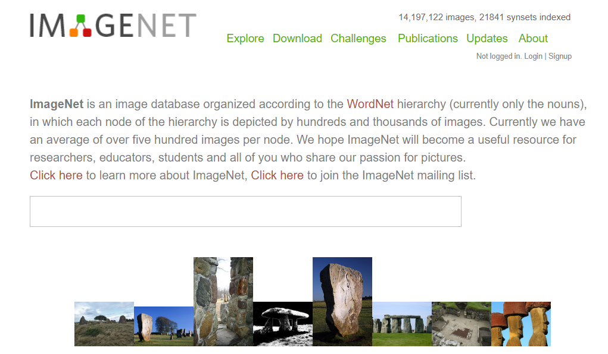

* **困难**
  1.当人的数量超过一定限度怎么办，比如不是几十几百而是上千万甚至上亿？
  2.每当一个新的个体录入到数据库的时候难道要重新训练一遍？
#### 能够做到不需要重新训练的方法——kNN、k-means等基于近邻的算法
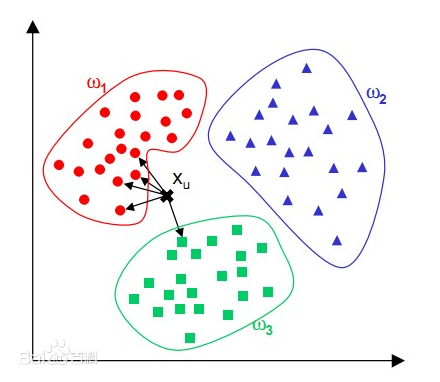
* **困难**：计算量过大，每次推理都需要用到数据库所有的数据，而且准确率很低
### 真正的解决办法——Deep Metric Learning
**深度度量学习（deep metric learning）**的目标是学习一个从原始特征到低维稠密的向量空间（称之为嵌入空间，embedding space）的映射，使得同类对象在嵌入空间上使用常用的距离函数（欧氏距离、cosine距离等）计算的距离比较近，而不同类的对象之间的距离则比较远。深度度量学习在计算机视觉领域取得了非常多的成功的应用，比如**人脸识别、人脸验证、图像检索、签名验证、行人重识别等**以及最新的**one/few-shot/meta learning**上的应用。 

#### 如何使用DML进行图像分类？
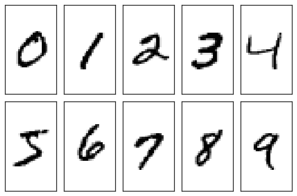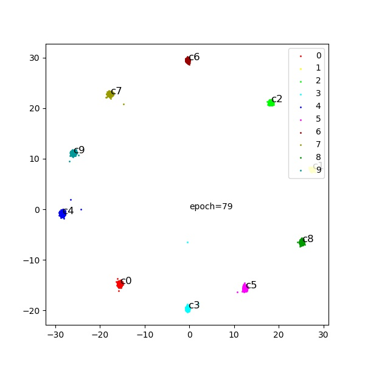
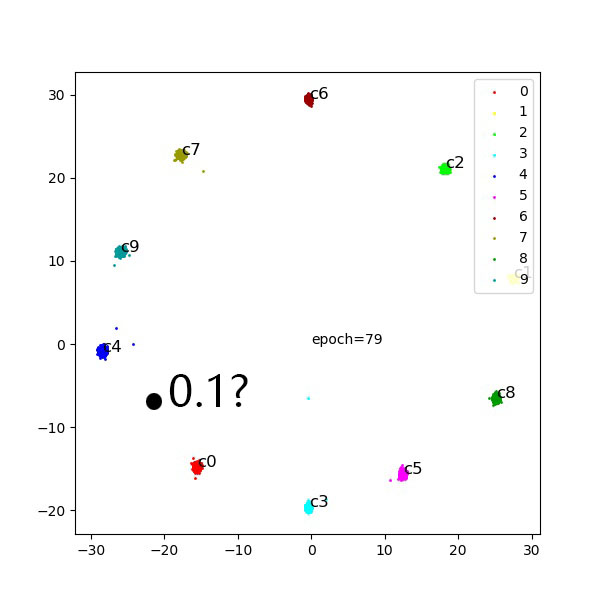

### 支付宝是怎么做到快速从数亿张脸中找到我的脸的？
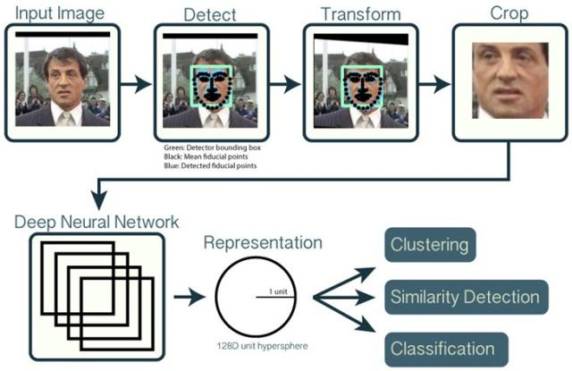
**简单来说就是 预处理+编码为向量 + 先验条件缩小搜索范围 + 高效率的向量相似度搜索的算法(Facebook的Faiss)**
1.对于使用自己的手机进行支付，在使用网络embedding后可以仅对比自己一个人的数据。
2.对于自动贩卖机刷脸支付 

* 物理区域：根据用户手机所在的基站区域或其他用户行为缩小搜索范围
* 历史记录：将使用过某台自动贩卖机的用户储存并进行优先搜索
* 其他先验知识：比如很容易的获得用户的身高范围，性别，预测年龄等
* 栅格化：先对比低分率的小头像，相以度高于某个值的数据集提取出来对比
* 并行化及专用芯片加速：将搜索过程交给高度并行化的算法及服务器或者专用的加速芯片
* 兜底策略：输入手机尾号
## DML-Algorithm
**学习一个度量相似度的距离函数:相似的目标离得近,不相似的离得远.** 

### General Pipeline
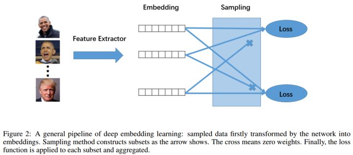
* 1.将Sample mini-batch(一般是C类每类挑K个,共N个数据)提取网络来map embedding然后通过L2-normalization来归一化网络的输出 
* 2.将每个数据都依次作为anchor(锚点)并使用采样策略组成多个sub-set
* 3.在每个sub-set上计算loss
### Embedding
* network
可以是现在常用的网络结构，如ResNet50或GoogLeNet等.但是一定要**pre-trained**否则收敛会很慢
* L2-normalization

    
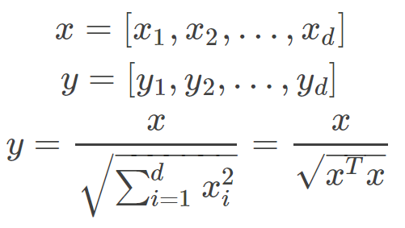

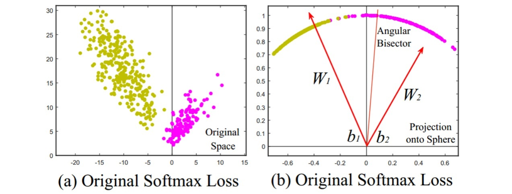
**L2-normalization得到了单位向量,其L2距离就和cos相似度成正比。**

### Loss
#### 1.Contrastive loss
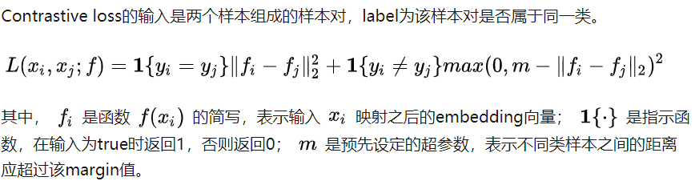
**contrastive loss只考虑了输入样本对本身的相似性**

#### 2.Triplet loss
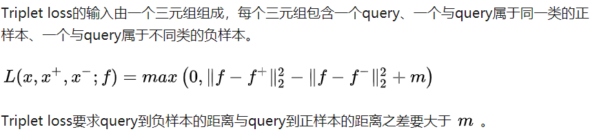
**Triplet-Loss的效果比Contrastive Loss的效果要好，因为他考虑了正负样本与锚点的距离关系。**

#### 3.N-pair-ms loss
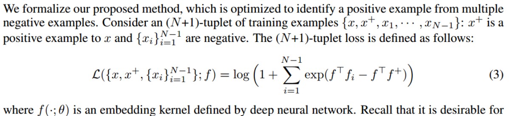
#### other
Margin Based Loss, Lifted Struct loss, Proxy NCA loss, Ranked list loss, Multi-Similarity loss

### Sampling matters
**提高数据的利用率来加速网络收敛**

#### 1.Naive sampling
按loss里面的项每一对样本都算距离,那么就是NXN对. 对triplet loss来说就是正样本两两之间然后再随机采样一个负样本,也是NXN个triplet
#### 2.Semi-hard sampling
在距离margin()里，对一个anchor,loop所有剩下正样本就构建了N个正样本对,然后每对正样本对采样一个负样本
#### 3.N-pairs sampling
基于anchor,loop后在每个负类中挑(一般是1)个
#### other
Softhard Sampling, Distance weighted sampling...
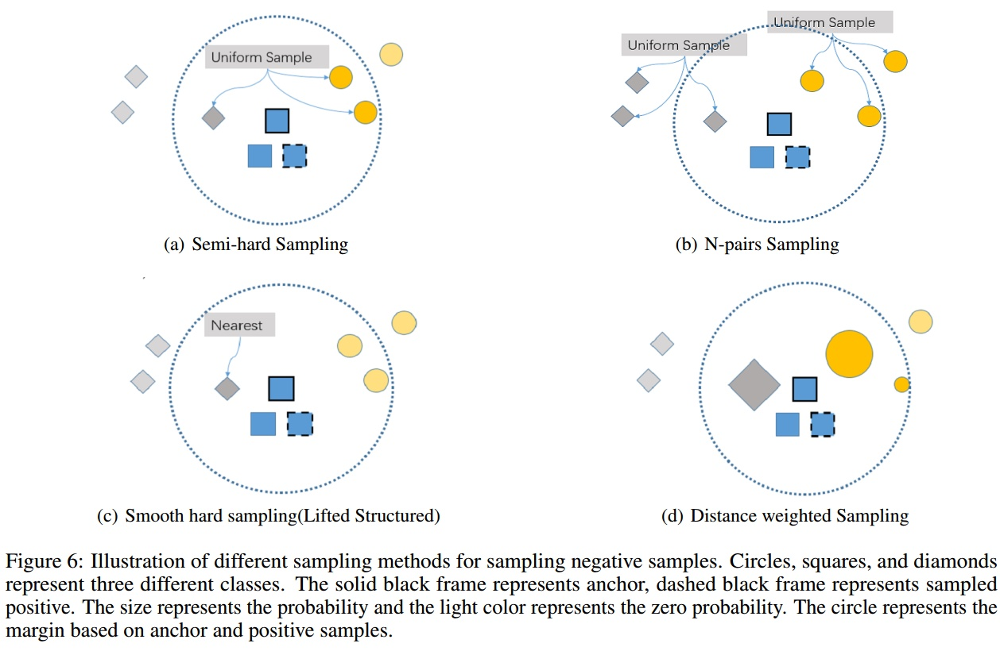

### Experiment Setting
* Dataset: Stanford Online Products, CARS196, and the CUB200-2011
* Eval:一般是Recall@K和NMI(一般用k-means聚类)(For Recall@K,Each test image (query) first retrieves K nearest neighbors from the test set and receives score 1 if an image of the same class is retrieved among the K nearest neighbors and 0 otherwise. Recall@K averages this score over all the images \cite{lifted}.NMI is normalized mutual information to evaluate the clustering result with given ground truth clustering . and denotes mutual information and entropy respectively.)
## Reference
[1]打个酱油, Deep Metric Learning, https://zhuanlan.zhihu.com/p/68200241
[2]赵赫 Mccree, Face Recognition Loss on Mnist with Pytorch, https://zhuanlan.zhihu.com/p/64427565
[3]杨旭东, 深度度量学习中的损失函数, https://zhuanlan.zhihu.com/p/82199561
[4]find goo, 支付宝是怎么做到快速从数亿张脸中找到我的脸的？,https://www.zhihu.com/question/359431172/answer/935555297
[5]ageitgey, face_recognition, https://github.com/ageitgey/face_recognition#face-recognition
[6]NIPS'2016, Improved Deep Metric Learning with Multi-class N-pair Loss Objective
[7]ICCV'2017, Sampling Matters in Deep Embedding Learning
[8]Confusezius, Deep-Metric-Learning-Baselines, https://github.com/Confusezius/Deep-Metric-Learning-Baselines