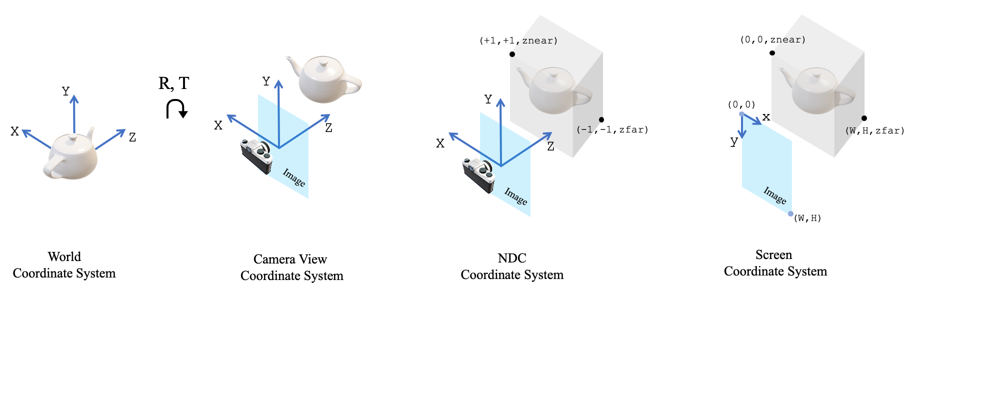
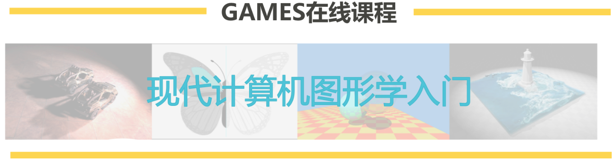
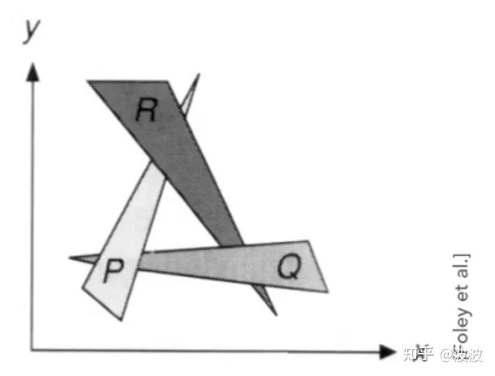
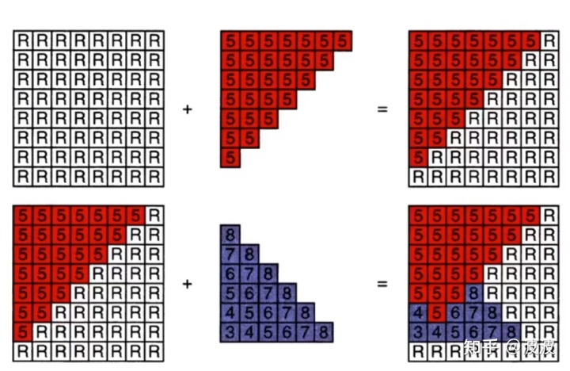

## 1.摄影学基础知识
### 1.1 内外参
内参K，表示了从一个三维世界中的物理量测单位（m，cm或mm）是如何映射到以像素为单位的数字影像上的。
$$
K = \begin{bmatrix}a_x & 0 & p_x \\ 0 & a_y & p_y \\ 0 & 0 & 1 \end{bmatrix}
$$
其中在opencv中$a_x,a_y,p_x,p_y$写作$f_x,f_y,c_x,c_y$均是指以像素为单位的。$[0,0],[1,1],[0,2],[1,2]$
$$
K = \begin{bmatrix}f_x & 0 & p_x \\ 0 & f_y & p_y \\ 0 & 0 & 1 \end{bmatrix}
$$

### 1.2 坐标系
https://github.com/facebookresearch/pytorch3d/blob/main/docs/notes/cameras.md
处理 3D 数据时，用户需要了解 4 个坐标系
* **World coordinate system**
This is the system the object/scene lives - the world.
* **Camera view coordinate system**
This is the system that has its origin on the image plane and the `Z`-axis perpendicular to the image plane. In PyTorch3D, we assume that `+X` points left, and `+Y` points up and `+Z` points out from the image plane. The transformation from world to view happens after applying a rotation (`R`) and translation (`T`).
* **NDC coordinate system**
This is the normalized coordinate system that confines in a volume the rendered part of the object/scene. Also known as view volume. For square images, under the PyTorch3D convention, `(+1, +1, znear)` is the top left near corner, and `(-1, -1, zfar)` is the bottom right far corner of the volume. For non-square images, the side of the volume in `XY` with the smallest length ranges from `[-1, 1]` while the larger side from `[-s, s]`, where `s` is the aspect ratio and `s > 1` (larger divided by smaller side).
The transformation from view to NDC happens after applying the camera projection matrix (`P`).
* **Screen coordinate system**
This is another representation of the view volume with the `XY` coordinates defined in pixel space instead of a normalized space. (0,0) is the top left corner of the top left pixel
and (W,H) is the bottom right corner of the bottom right pixel.

An illustration of the 4 coordinate systems is shown below




不同的软件中的坐标


### 1.3 坐标系变换
#### 1.3.1 world2cam 3d
形式一：
$$
\begin{bmatrix}x_c\\y_c\\z_c\\1\end{bmatrix}=
\begin{bmatrix}R & T \\ 0_{3}^{T}&1\end{bmatrix}
\begin{bmatrix}x_w\\y_w\\z_w\\1\end{bmatrix}
$$
更容易理解的：
$$
X_c = RX_w +T
$$
#### 1.3.2 cam2world 3d
$$
X_w = R^{-1} (X_c-T)
$$
#### 1.3.3 尺度不一致时的坐标变换
```bash
scale = 211.54
camera_param = {}
Kc, Rc, Tc = Ks[4].copy(), Rs[4].copy(), Ts[4].copy()
for i in range(0, len(Names)):
	K, R, T = Ks[i], Rs[i], Ts[i]
	R = Rc.T @ R
	T = T - Tc
	T = T * scale
	camera_param[i] = {'K':{'data':K.reshape(-1).tolist(),  'cols':3, 'rows':3},
			   'R':{'data':R.reshape(-1).tolist(),  'cols':3, 'rows':3},
			   'T':{'data':T.reshape(-1).tolist(),  'cols':1, 'rows':3},
			   'D':{'data':[0.0, 0.0, 0.0, 0.0, 0.0],  'cols':1, 'rows':5}}
	Ks[i], Rs[i], Ts[i] = K, R, T

js = json.dumps(camera_param, sort_keys=True, indent=4)
with open('camera_param.json', 'w') as js_f:
js_f.write(js)
```

## 2.图形学基础知识 

[GAMES101:现代计算机图形学入门](https://games-cn.org/intro-graphics/)



### 2.1 立体图形的几何表示

#### 2.1.1 mesh
#### 2.1.2 surfel
#### 2.1.3 multi-view
#### 2.1.4 point cloud
点云是某个坐标系下的点的数据集。点包含了丰富的信息，包括三维坐标X，Y，Z、颜色、分类值、强度值、时间等等。
$$
\bold{P}=\{p_1,p_2,...,p_N\}
$$

### 2.2 z-buffer 与 frame buffer

物体交叉关系，Q:三角形PRQ，谁在前，谁在后，这个不好判断

为了解决这个问题把离我们眼睛最近的像素z轴缓存起来，叫深度缓存，或者叫深度图 z-buffer
把离我们眼睛最近的像素点混合后的信息缓存起来，叫做frame buffer

z-buffer的运算方法：
①默认是无限远用R表示
②叠加一些深度是5的像素点，5比R小，修改深度图把对应的R改成5
③叠加一些深度不一的像素，对应比较，用小的替代大的


注意深度图只记录比较小的值，无论先计算哪个像素最终都可以得到正确的结果

#### 2.2.1 Z-Buffer消隐算法
#### 


## 其他待了解的
1.点云重建mesh一般用柏松重建，或转化成TSDF，再用marching cube重建成mesh