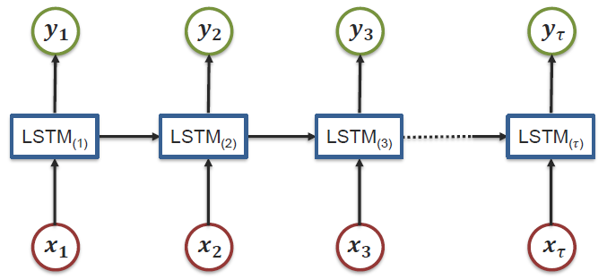
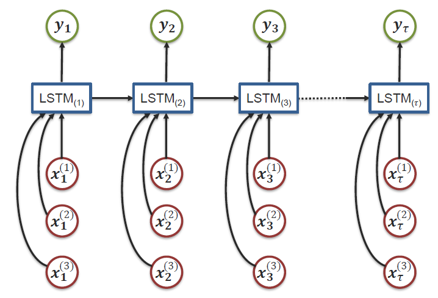
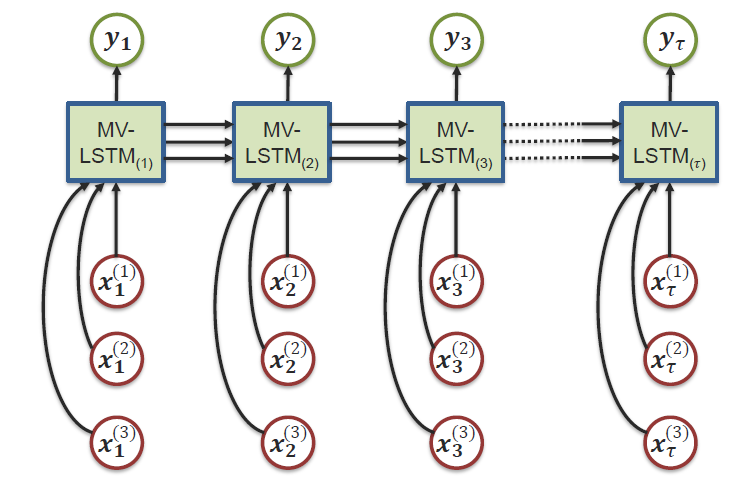
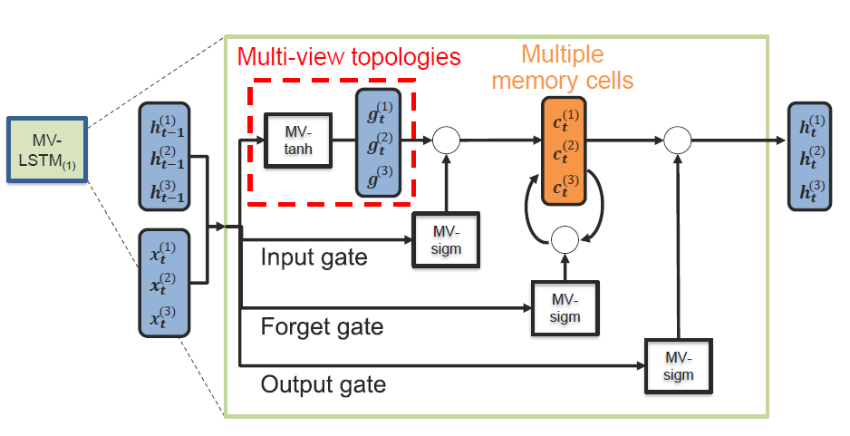

[toc]
#  MultiModal Machine Learning (MMML) 
每一种信息的来源或者形式，都可以称为一种模态。例如，人有触觉，听觉，视觉，嗅觉；信息的媒介，有语音、视频、文字等；多种多样的传感器，如雷达、红外、加速度计等。以上的每一种都可以称为一种模态。 
多模态机器学习，英文全称 MultiModal Machine Learning (MMML)，旨在通过机器学习的方法实现处理和理解多源模态信息的能力。目前比较热门的研究方向是图像、视频、音频、语义之间的多模态学习。 

## 研究方向简述
#### 多模态表示学习 Multimodal Representation(P125)
单模态的表示学习负责将信息表示为计算机可以处理的数值向量或者进一步抽象为更高层的特征向量，而多模态表示学习是指通过利用多模态之间的互补性，剔除模态间的冗余性，从而学习到更好的特征表示。主要包括两大研究方向：联合表示（Joint Representations，P125）和协同表示（Coordinated Representations，P139）。 

#### 模态转化 Translation(P168)
转化也称为映射，负责将一个模态的信息转换为另一个模态的信息。常见的应用包括：

* **机器翻译（Machine Translation）：**将输入的语言A（即时）翻译为另一种语言B。类似的还有唇读（Lip Reading）和语音翻译 （Speech Translation），分别将唇部视觉和语音信息转换为文本信息。
*  **图片描述（Image captioning) 或者视频描述（Video captioning)：** 对给定的图片/视频形成一段文字描述，以表达图片/视频的内容。 
*  **语音合成（Speech Synthesis）**：根据输入的文本信息，自动合成一段语音信号。
#### 对齐 Alignment(P178)
多模态的对齐负责对来自同一个实例的不同模态信息的子分支/元素寻找对应关系。这个对应关系可以是时间维度的,又可以是空间维度的。 
*  **Temporal sequence alignment**  电影画面-语音-字幕的自动对齐 
*  **图片语义分割 （Image Semantic Segmentation）**：尝试将图片的每个像素对应到某一种类型标签，实现视觉-词汇对齐。 
#### 多模态融合 Multimodal Fusion(P206)
多模态融合（Multimodal Fusion ）负责联合多个模态的信息，进行目标预测（分类或者回归）.应用广泛，如多源信息融合（Multi-source Information Fusion）、多传感器融合（Multi-sensor Fusion)。
#### 协同学习 Co-learning
协同学习是指使用一个资源丰富的模态信息来辅助另一个资源相对贫瘠的模态进行学习。 
* **迁移学习（Transfer Learning）:**迁移学习比较常探讨的方面目前集中在领域适应性（Domain Adaptation）问题上.目前的分支领域有零样本学习（Zero-Shot Learning）和一样本学习（One-Shot Learning）
* **协同训练（Co-training ）：**负责研究如何在多模态数据中将少量的标注进行扩充，得到更多的标注信息。
## 多模态表示学习 Multimodal Representation(P125)
单模态的表示学习负责将信息表示为计算机可以处理的数值向量或者进一步抽象为更高层的特征向量，而多模态表示学习是指通过利用多模态之间的互补性，剔除模态间的冗余性，从而学习到更好的特征表示。主要包括两大研究方向：联合表示（Joint Representations，P125）和协同表示（Coordinated Representations，P139）。 

* **联合表示**将多个模态的信息一起映射到一个统一的多模态向量空间(本质就是提取特征，自编码器方法等)； 应用包括信息检索，也可以用于的分类/回归任务。
* **协同表示**负责将多模态中的每个模态分别映射到各自的表示空间，但映射后的向量之间满足一定的相关性约束（例如线性相关）。 例子:《Unifying Visual-Semantic Embeddings with Multimodal Neural Language Models 》利用协同学习到的特征向量之间满足加减算数运算这一特性，可以搜索出与给定图片满足“指定的转换语义”的图片。例如：狗的图片特征向量 - 狗的文本特征向量 + 猫的文本特征向量 = 猫的图片特征向量 -> 在特征向量空间，根据最近邻距离，检索得到猫的图片.

### Example: SoundNet 从未标记的视频中学习声音表征
SoundNet  Learning Sound Representations from Unlabeled Video 
通过有效利用大量从野外收集的未标记声音数据，我们学习了丰富 的自然声音表征。使用两百万未标记的视频，我们利用时间和声音的自然同步来学习声学表征。未标记视频的优势是在经济有限情况下也能获得大规模的、包含有用信号的数据。我们提出一种 student-teacher 训练流程，使用未标记视频作为桥梁，能将来自好的视觉识别模型的有识别力的视觉知识迁移到声音形态。在声学场景/识别分类基准上，我们的声音表征对前沿表现有了极大的改进。可视化数据表明一些高层次语义可在该声音网络中自动生成，即使它是在没有 ground truth 标记的情况下训练的。

通过SoundNet架构与ImageNet,Place CNN等进行联合训练。首先视频数据集中的每个视频都切分成两部分，一部分为音频，一部分为RGB图像帧。视觉识别网络采用在ImageNet和Places两个大型图像数据集上的预训练VGG模型。ImageNet和Places都是图像识别领域的大型数据集，其中Imagenet是图像目标分类数据集，Places是图像场景分类数据集。将从视频中分割出来的RGB帧输入到预训练的VGG模型（代码中正常使用ResNet34）中，得到的输出结果作为声音识别网络的监督信息。声音识别网络采用8层的全卷积结构，使用从视频中提取出的声音时间序列作为网络的输入，损失函数采用KL-divergence。

## 多模态融合 Multimodal Fusion
多模态融合（Multimodal Fusion ）负责联合多个模态的信息，进行目标预测（分类或者回归）
 
* **应用：**视听语音识别、多媒体事件检测、多模态情感识别等
* **主要分为:**Model free approaches(Early, late, hybrid),Model-based approaches(Kernel Methods,Graphical models,Neural networks)
### Model free approaches
#### early fusion
 
#### late fusion
 
#### hybrid fusion
 

### Model-based approaches
#### Kernel Methods
 
Multiple Kernel Learning是内核支持向量机(SVM)的扩展，它允许使用不同的内核来处理不同的数据模式/视图。由于可以将内核视为数据点之间的相似函数，所以MKL中特定于模式的内核可以更好地融合异构数据
 
 

#### Neural networks
Memory Fusion Network for Multi-view Sequential Learning.pdf

#### Graphical models
MoodExplorer: Towards Compound Emotion Detection via Smartphone Sensing

## Reference
https://blog.csdn.net/electech6/article/details/85142769
《Tutorial on Multimodal Machine Learning》
Multimodal Machine Learning A Survey and Taxonomy.pdf

